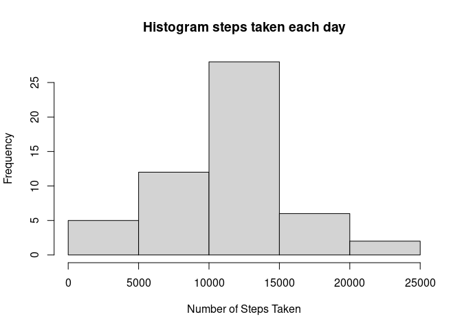
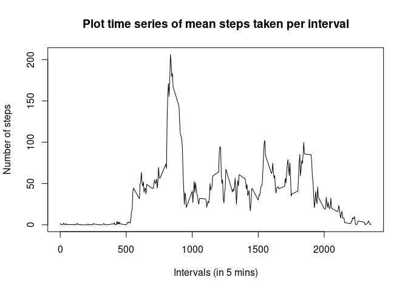
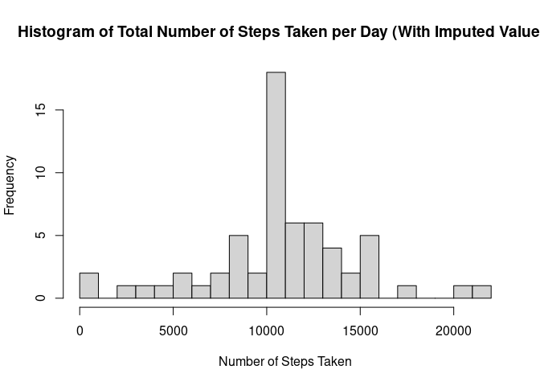
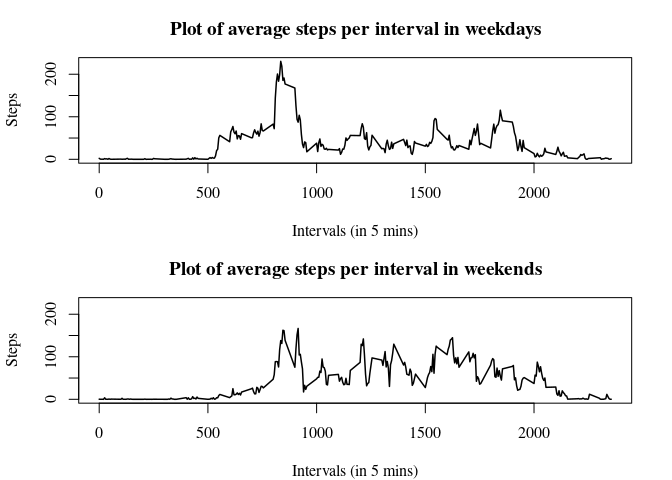

## Loading and preprocessing the data

1.  Unzip and read data to dataframe


```r
unzip("activity.zip")
preprocessedData <- read.csv(file="activity.csv", colClasses=c("numeric", "Date", "numeric"))
```

2.  Show data head and some contents


```r
head(preprocessedData)
```

```
##   steps       date interval
## 1    NA 2012-10-01        0
## 2    NA 2012-10-01        5
## 3    NA 2012-10-01       10
## 4    NA 2012-10-01       15
## 5    NA 2012-10-01       20
## 6    NA 2012-10-01       25
```

```r
str(preprocessedData)
```

```
## 'data.frame':	17568 obs. of  3 variables:
##  $ steps   : num  NA NA NA NA NA NA NA NA NA NA ...
##  $ date    : Date, format: "2012-10-01" "2012-10-01" ...
##  $ interval: num  0 5 10 15 20 25 30 35 40 45 ...
```

## What is mean total number of steps taken per day?

1.  remove NA from steps


```r
dataWithoutNA <- preprocessedData[!(is.na(preprocessedData$steps)), ]
```

-   Calculate number of steps taken every day and agregate them in sum


```r
agregateStepsByDay <- aggregate(steps ~ date, dataWithoutNA, sum)
head(agregateStepsByDay)
```

```
##         date steps
## 1 2012-10-02   126
## 2 2012-10-03 11352
## 3 2012-10-04 12116
## 4 2012-10-05 13294
## 5 2012-10-06 15420
## 6 2012-10-07 11015
```

2.  Histogram of steps taken each day


```r
hist(agregateStepsByDay$steps, xlab="Number of Steps Taken", 
     main="Histogram steps taken each day")
```

<!-- -->

3.  Mean and median of steps per day


```r
library(dplyr)
```

```
## 
## Attaching package: 'dplyr'
```

```
## The following objects are masked from 'package:stats':
## 
##     filter, lag
```

```
## The following objects are masked from 'package:base':
## 
##     intersect, setdiff, setequal, union
```

```r
totalSteps <- summarise(agregateStepsByDay, meanOfTotalSteps=mean(agregateStepsByDay$steps),
                               medianOfTotalSteps=median(agregateStepsByDay$steps))
print(totalSteps)
```

```
##   meanOfTotalSteps medianOfTotalSteps
## 1         10766.19              10765
```

## What is the average daily activity pattern?

1. Time series plot of 5 min interval

- Do agregation of mean of steps by interval


```r
meanStepsInterval <- aggregate(steps ~ interval, dataWithoutNA, mean)
head(meanStepsInterval)
```

```
##   interval     steps
## 1        0 1.7169811
## 2        5 0.3396226
## 3       10 0.1320755
## 4       15 0.1509434
## 5       20 0.0754717
## 6       25 2.0943396
```

- Plot time series using base system


```r
plot(x=meanStepsInterval$interval, y=meanStepsInterval$steps, type="l",
     main="Plot time series of mean steps taken per interval",
     ylab="Number of steps", xlab="Intervals (in 5 mins)")
```

<!-- -->

2. The 5 min interval containing the maximum of steps


```r
meanStepsInterval[grep(max(meanStepsInterval$steps), meanStepsInterval$steps), ]
```

```
##     interval    steps
## 104      835 206.1698
```

## Imputing missing values

1. Total of missing values (NA's) in steps as we saw before


```r
sum(is.na(preprocessedData$steps))
```

```
## [1] 2304
```

2, 3 . Fill up the NA's with the mean of that interval


```r
reconstructedData <- preprocessedData
for(x in 1:17568) {
    if(is.na(reconstructedData[x, 1])==TRUE) {
        reconstructedData[x, 1] <- meanStepsInterval[meanStepsInterval$interval %in% reconstructedData[x, 3], 2]
    }
}
head(reconstructedData)
```

```
##       steps       date interval
## 1 1.7169811 2012-10-01        0
## 2 0.3396226 2012-10-01        5
## 3 0.1320755 2012-10-01       10
## 4 0.1509434 2012-10-01       15
## 5 0.0754717 2012-10-01       20
## 6 2.0943396 2012-10-01       25
```

4. Histogram of steps by day and mean and median

- Create variable with the total steps by day


```r
reconstructedTotalStepsDay <- aggregate(steps ~ date, reconstructedData, sum)
head(reconstructedTotalStepsDay)
```

```
##         date    steps
## 1 2012-10-01 10766.19
## 2 2012-10-02   126.00
## 3 2012-10-03 11352.00
## 4 2012-10-04 12116.00
## 5 2012-10-05 13294.00
## 6 2012-10-06 15420.00
```

- plot histogram 

```r
hist(reconstructedTotalStepsDay$steps, breaks=20, xlab="Number of Steps Taken", 
     main="Histogram of Total Number of Steps Taken per Day (With Imputed Values)")
```

<!-- -->

- Mean an median of total steps


```r
reconstructedStepsSummary <- summarise(reconstructedTotalStepsDay, 
                                 meanOfTotalSteps=mean(reconstructedTotalStepsDay$steps), 
                                 medianOfTotalSteps=median(reconstructedTotalStepsDay$steps))  
print(reconstructedStepsSummary)
```

```
##   meanOfTotalSteps medianOfTotalSteps
## 1         10766.19           10766.19
```


- Compare of result with previous calculation including NA's shows that the mean is the same but the median is almost the same
This may be because filling up the gaps (NA) with its mean actually does not change much, another story would be if we aggregate by day


```r
rbind(totalSteps, reconstructedStepsSummary)
```

```
##   meanOfTotalSteps medianOfTotalSteps
## 1         10766.19           10765.00
## 2         10766.19           10766.19
```

## Are there differences in activity patterns between weekdays and weekends?

1. create a factor variable for weekdays and weekends

- Include 2 new columns and fill them with the specific day of the week and if its weekday or weekend
- I decided to use lubridate in order to get the week day in a numeric format due to languaje diferences

```r
library(lubridate) 
```

```
## 
## Attaching package: 'lubridate'
```

```
## The following objects are masked from 'package:base':
## 
##     date, intersect, setdiff, union
```

```r
daysData <- reconstructedData
daysData$days <- lubridate::wday(daysData$date, week_start = 1)
daysData$weekday <- as.character(rep(0, times=17568))
for(x in 1:17568) {
    if(daysData[x, 4] %in% c(6, 7)) {
        daysData[x, 5] <- "weekend"
    } else {
        daysData[x, 5] <- "weekday"
    }
}
daysData$weekday <- factor(daysData$weekday)
head(daysData)
```

```
##       steps       date interval days weekday
## 1 1.7169811 2012-10-01        0    1 weekday
## 2 0.3396226 2012-10-01        5    1 weekday
## 3 0.1320755 2012-10-01       10    1 weekday
## 4 0.1509434 2012-10-01       15    1 weekday
## 5 0.0754717 2012-10-01       20    1 weekday
## 6 2.0943396 2012-10-01       25    1 weekday
```

2. Panel plot of the 5 min interval with the average number of steps

- extract the data and calculate mean

```r
weekdayData <- daysData[daysData$weekday=="weekday", ]
weekendData <- daysData[daysData$weekday=="weekend", ]

weekdayMean <- aggregate(steps ~ interval, weekdayData, mean)
weekendMean <- aggregate(steps ~ interval, weekendData, mean)
```


```r
par(mfrow=c(2, 1), mar=c(4, 4.1, 3, 2.1))
plot(weekdayMean$interval, weekdayMean$steps, type="l",
     main="Plot of average steps per interval in weekdays",
     xlab="Intervals (in 5 mins)", ylab="Steps", family="serif", lwd=1.5, ylim=c(0, 230))
plot(weekendMean$interval, weekendMean$steps, type="l",
     main="Plot of average steps per interval in weekends",
     xlab="Intervals (in 5 mins)", ylab="Steps", family="serif",lwd=1.5, ylim=c(0, 230))
```

<!-- -->
